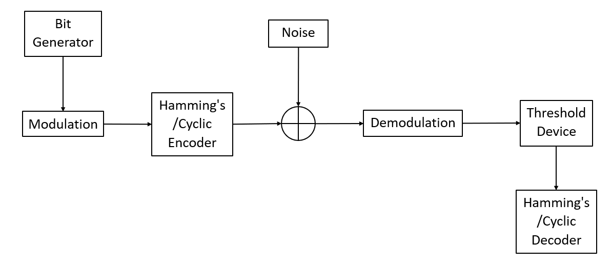
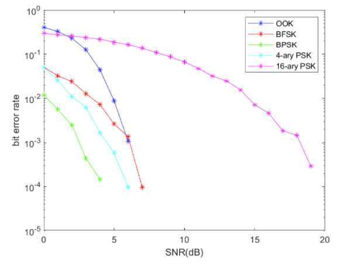

# Digital Communication

## Background

In the realm of digital communications, the two main types of signals that are used to transfer data from one place to another are analog signals as well as digital signals. Analog signals are continuous wave signals which vary with time period whereas digital signals represent data as a sequence of discrete values in the form of binary. However, digital signals are widely preferred over analog signals due to its advantages in being more robust to noise, more reliable in transmission, lower cost as well as higher flexibility in design. However, day-to-day signals are analog in nature. Hence, there is a need to convert analog into digital signals and back. This is done through a transmitter and a receiver using modulation and demodulation methods such as On-Off-Keying(OOK), Phase Shift Keying(PSK) as well as other methods in order to reduce errors during transmission.

## Objectives

The main aim of this project will be to implement a basic communication system using MATLAB. The project will allow us to generate data and pass it through a system which performs baseband modulation and demodulation as well as a Gaussian noise channel. We will then be able to analyze the results and calculate the bit error rate performance. We will also include different modulation methods such as On-Off Keying as well as Binary Phase Shift Keying to see which modulation scheme works the best. Lastly, by including error control codes, we intend to see an improvement in the performance of the system.

## Overview

This course project is broken down into three phases:

- **Phase 1**: Baseband transmission system
- **Phase 2**: Bandpass transmission system
- **Phase 3**: Basic error control coding to improve performance

We are expected to implement the system according to these three phases and from the results, achieve our objectives of learning how different modulation methods will affect the resulting signals as well as possible methods to enhance the performance of a simple digital communication system.

## Phase 1: Baseband Transmission System

In this phase, we are experimenting on the effects of SNR on the bit error rate of baseband transmission. Firstly, random binary digits of length 1024 are generated. Upon transmission, the binary digits are converted from unipolar NRZ to bipolar NRZ with amplitude 1. Next, according to the SNR value that we want to test out, we calculate the noise power and generate an equal number of noise samples. By assuming the signal power is 1, the formula to calculate noise power is shown below.

  

The received signal will be the sum of the transmitted signal and the noise samples. At the receiver side, a threshold of 0 is fixed, if the received signal has a value greater than 0, then bit 1 is detected, else if the received signal has a value less than 0, then bit 0 is detected. The block diagram of the transmission system is shown in the diagram below:

The bit error rate is then calculated by dividing the number of bits that are different by the total number of bits transmitted. In our code, for each SNR value tested, we obtain the bit error rate for 20 samples of length 1024, then take the average bit error rate.

## Phase 2: Bandpass Transmission System

In phase 2, we extended the transmission system in phase 1 by modulating the signal before transmission. This phase converts baseband transmission in phase 1 into bandpass transmission. Several modulation schemes have been tried out, including:

- On-Off Keying (OOK),
- Binary Frequency Shift Keying (BFSK),
- Binary Phase Shift Keying (BPSK), and
- M-ary Phase Shift Keying

Here, we used a carrier frequency of 10KHz and the amplitude of the carrier signal is 5V. The block diagram for the transmission system in phase 2 is shown below:

### On-Off Keying (OOK)

In OOK modulation, when the bit is 1, it will transmit the carrier signal; when the bit is 0, it will transmit a constant 0V. In OOK demodulation, a non-coherent detector (square-law detector) is used. The receiver first squares the signal, then passes it through a low pass filter and then takes the signal’s square root. The demodulated signal is then passed to the threshold device, a decision threshold of 2V is used in this case.

### Binary Frequency Shift Keying (BFSK)

In BFSK modulation, we use carrier frequency 15KHz and 5KHz to transmit bits 1 and 0 respectively. We used a quadrature detector at the receiver to detect the bits transmitted. The decision threshold used is 0V.

### Binary Phase Shift Keying (BPSK)

To generate a BPSK signal, we use 2 carrier signals with a 180-degree phase difference to represent bits 1 and 0. During demodulation, we use a coherent detector which first multiplies the received signal with the reference signal, then passes it through a low pass filter and then take the signal’s square root. The decision threshold used is 2V.

### M-ary Phase Shift Keying (M-ary PSK)

For M-ary PSK, the transmitted signal is generated based on the formula below where i=0,1,2...,M-1

  

The M-ary PSK demodulator and threshold device is shown in the block diagram below:

An example of waveforms of signal in a 4-ary PSK transmission system is shown below:

### Bit Error Rate Comparison

Among all modulation schemes, we can see that BPSK and 4-ary PSK perform the best. Also from the plot comparing several M-ary PSKs, we can observe that when the value of M increases, the bit error rate increases.

.png)

## Phase 3: Basic error control coding to improve performance

In phase 3, we experimented with 2 different encoders; Hamming & Cyclic encoders. The encoder is placed before the modulation and a decoder is placed after demodulation. We will then compare the output bits using these encoders compared to the original data to determine the error rate. The block diagram for the transmission system in phase 3 is shown below:

| Hamming's Code | Cyclic Code |
|-|-|
|  |  |

Using both block codes, we can see that the trend for using Hamming code and Cyclic code is very similar. This is due to the similar properties between them. A Hamming code can actually be written as a cyclic code. In fact, any Hamming code can be converted to a cyclic code as long as they follow the form of Ham(r, 2). Then what is the difference? Hamming code is mainly used in correcting single errors as compared to a Cyclic code where it is used to correct burst errors. Hence, it terms of which error control is better, it all comes to which errors are we correcting. As seen with the graphs after this, we can see that the Hamming code and Cyclic code dealt blows to each other, where one can be better than the other and vice versa.

| Modulation Scheme | Bit Error Rate |
|-|-|
| OOK |  |
| BFSK |  |
| BPSK |  |
| 4-ary PSK |  |
| 16-ary PSK |  |

Based on the figures above, the bit error rate performances of the different modulation techniques improved when error control coding was implemented, with the exception of 16-ary PSK modulation. One possible reason for this will be the error control code only works for a minimum bit error rate. Error control code will not perform well when the bit error rate is too high.

## Conclusion

For the data generation phase, we can conclude that the higher the SNR, the lower the error bit rate.

Among all modulation schemes, we can observe that BPSK and 4-ary PSK perform the best in terms of bit error rate compared to OOK and BFSK. From the plot comparing several M-ary PSKs, we can see that to achieve the same bit error rate, a higher SNR ratio is needed for the greater value of M.

With error control coding, the bit error rate decreases significantly in most of the modulation methods. Hamming and cyclic coding produce similar outcomes as they share similar properties.

